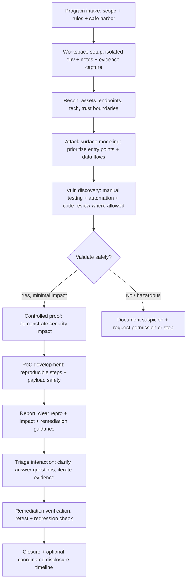
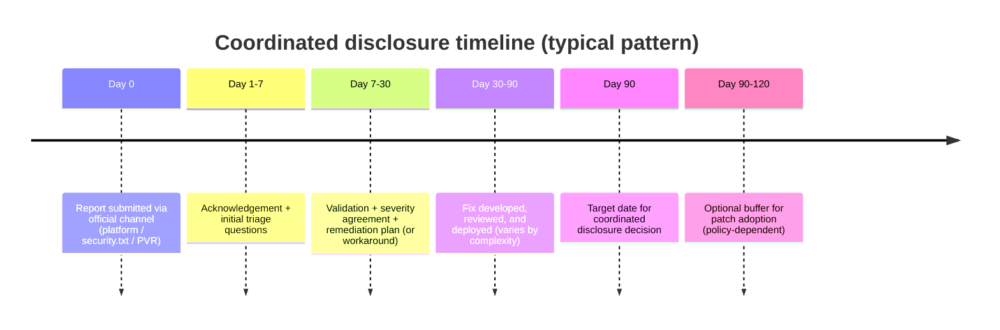

# Bug Bounty Discipline: Methods, Scenarios, and Tools

## Executive summary

Bug bounty discipline is the systematic practice of finding, documenting, and responsibly disclosing security vulnerabilities **within explicit authorization boundaries (program scope and rules)**, so that organizations can remediate and verify fixes with minimal risk to users and systems. Modern programs often sit on a continuum from **Vulnerability Disclosure Programs (VDPs)** (clear reporting channel + safe harbor, typically no guaranteed payment) to **Bug Bounty Programs (BBPs)** (incentivized reporting via rewards and more complex configuration and response targets). citeturn20view0

A rigorous bug bounty workflow resembles a lightweight, continuous penetration test lifecycle: reconnaissance → hypothesis-driven testing → controlled validation (proof) → report writing → remediation verification. Canonical guidance for structuring “receive → verify → remediate → disclose” processes is captured in vulnerability disclosure and handling standards (ISO/IEC 29147 and ISO/IEC 30111) and echoes in public-sector templates like CISA’s Vulnerability Disclosure Policy (VDP) template. citeturn1search0turn1search1turn1search2

Key operational insight: the **highest leverage** comes from (a) strong scoping literacy (what is authorized / ineligible), (b) high-signal reporting (reproducible, impact-driven), and (c) safe, rate-controlled tooling. HackerOne explicitly emphasizes quality reports (clear title, detailed reproduction steps, impact, and supporting evidence) as a driver of faster triage, while Bugcrowd similarly requires reports to explain where the bug was found, who it affects, how to reproduce it, and proof-of-concept evidence. citeturn6view1turn4search5

From a governance risk perspective, mature programs increasingly formalize **safe harbor**: GitHub’s bug bounty legal safe harbor frames compliant research as “authorized” and commits not to pursue legal action for accidental/good-faith violations of program policy; HackerOne’s Gold Standard Safe Harbor similarly defines good-faith research and stresses that safe harbor cannot bind third parties. citeturn6view4turn19view0

Finally, effective programs are measurable. Platforms expose responsiveness and throughput metrics (e.g., HackerOne response efficiency and time-to-triage; Bugcrowd efficiency and time-to-fix views), enabling “program health” KPIs and better incentives for researcher performance. citeturn7search0turn7search12turn7search1turn16search31

## Discipline scope and goals

Bug bounty discipline is best understood as a **repeatable professional practice** with two simultaneous goals:

**Security outcome goal (organization-facing):** identify vulnerabilities with real security impact and enable rapid remediation and verification, consistent with structured security testing guidance (planning and conducting tests, analyzing findings, and developing mitigations). citeturn3search1

**Professional integrity goal (researcher-facing):** operate as “good faith” security research—i.e., testing designed to avoid harm and produce information primarily aimed at improving safety/security—within the program’s authorization boundaries and disclosure process. This framing appears both in the U.S. DOJ CFAA charging policy definition of *good faith security research* and in major platform safe harbor language (HackerOne, GitHub). citeturn11search0turn19view0turn6view4

A practical way to scope the discipline is along the VDP ↔ BBP continuum:

* **VDP:** provides guidelines for how to notify an organization of vulnerabilities; typically includes purpose/promise, scope, safe harbor, process description, evaluation timelines, and disclosure conditions. citeturn20view0turn1search2  
* **BBP:** adds incentives (monetary rewards), often has public/private participation controls, and typically requires additional configuration (bounty structure, response targets). citeturn20view0turn7search4

Two foundational governance artifacts make this discipline operational at scale:

**A discoverable reporting channel**: RFC 9116 defines *security.txt* as a machine-readable way for organizations to publish vulnerability disclosure contact and policy information, addressing the common failure mode that researchers cannot find an appropriate channel. citeturn3search0turn3search8

**A standard disclosure and handling process**: ISO/IEC 29147 describes techniques and policy considerations for vulnerability disclosure (including examples of communications), while ISO/IEC 30111 focuses on handling processes for reported vulnerabilities (processing and remediation). citeturn1search0turn1search1

## End-to-end methodology and workflows

A disciplined workflow is **hypothesis-driven** (you form and test security hypotheses) and **artifact-driven** (you produce evidence that others can validate). The OWASP Web Security Testing Guide (WSTG) is widely used as a structured testing reference for web applications and services, while OWASP’s API, mobile, and IoT projects provide domain-specific risk lenses. citeturn2search0turn2search1turn2search2turn12search0

### Reference workflow



This flow aligns with platform expectations around **reproducibility and impact** (HackerOne quality report guidance; Bugcrowd reporting requirements) and with standardized disclosure/handling process thinking (receive → verify → remediate → disclose). citeturn6view1turn4search5turn1search0turn1search1

### Step-by-step workflow details

**Program intake and constraints (non-negotiable):**  
Start by reading scope, ineligible findings, and hazardous testing restrictions. HackerOne publishes a “core ineligible findings” list that highlights classes of low-signal or non-impactful issues (e.g., clickjacking on pages without sensitive actions, permissive CORS without impact) and explicitly warns against hazardous testing such as DoS or user-noisy attacks unless authorized. citeturn18view0

**Reconnaissance (recon):**  
Goal: enumerate *authorized* assets, map technology, and locate trust boundaries (auth, session, object IDs, third-party integrations). Use passive-first techniques when feasible; rate-limit active probes. NIST’s testing guidance emphasizes planning and selecting techniques with benefits/limitations in mind—this translates into recon choices like passive OSINT vs active scanning, and when each is justified. citeturn3search1turn13search0turn13search1

**Vulnerability discovery:**  
Combine (1) structured checklists (e.g., OWASP WSTG for web, OWASP API Top 10 for APIs, OWASP MASVS for mobile) with (2) product-specific hypotheses (business logic, authorization boundaries, multi-tenant behavior). citeturn2search0turn2search1turn2search2

**Exploitation (controlled validation, not “max damage”):**  
In bug bounty discipline, exploitation is **a controlled demonstration of impact**, not a red-team objective of deep persistence. Safe harbor and good-faith definitions repeatedly emphasize avoiding harm and staying within guidelines; if a test might create availability risk or user harm, stop and seek clarification. citeturn19view0turn11search0turn18view0

**Proof-of-concept (PoC) development:**  
A PoC should be:
1) **minimal** (fewest steps, least privilege),  
2) **reproducible** (deterministic steps, stable environment notes),  
3) **impact-evidencing** (shows confidentiality/integrity/availability impact), and  
4) **safe** (no broad scans outside scope; no destructive payloads).  

For severity language, use either CVSS (v4.0 is an open framework used to communicate characteristics/severity) or a program/platform taxonomy like Bugcrowd’s Vulnerability Rating Taxonomy (VRT). citeturn3search2turn4search6turn7search34

**Reporting:**  
High-signal reporting is a core competency. HackerOne explicitly calls for a clear title, detailed reproduction steps, impact explanation, and supporting materials; Bugcrowd requires where found, who it affects, how to reproduce, and PoC evidence. citeturn6view1turn4search5

**Remediation verification (retest):**  
Treat retesting as a mini regression test: verify the exact root cause is fixed (not just a superficial block) and check common bypass variants. Platforms recognize that bypassed fixes can make new reports eligible again (e.g., Bugcrowd duplicate rules note that if an issue is still reproducible, it can be treated as unique/eligible). citeturn16search3

### Sample vulnerability report template

```text
Title:
  [VULN CLASS] allows [IMPACT] via [VECTOR] on [ASSET/ENDPOINT]

Summary:
  One-paragraph overview of what is broken and why it matters.

Scope confirmation:
  Program:
  In-scope asset(s):
  Account type used (test account, low-priv user, etc.):
  Testing window + IP (if required by policy):

Severity (pick what the program expects):
  CVSS v4.0 vector (if used) + rationale
  or Bugcrowd VRT category + priority suggestion

Affected component(s):
  URL(s)/endpoint(s):
  Parameters/headers:
  Build/version (if relevant):
  Feature flags / tenant / org ID (if relevant):

Threat model & impact:
  Confidentiality: (what data can be read?)
  Integrity: (what can be changed?)
  Availability: (what can be disrupted?)
  Business impact: (fraud, account takeover, data exposure, etc.)

Steps to reproduce (deterministic):
  1.
  2.
  3.
  Expected vs actual behavior:

Proof of concept evidence:
  HTTP requests/responses (sanitized)
  Screenshots / screen recording
  Logs (redacted)
  Optional: minimal script that reproduces (no destructive automation)

Suggested remediation:
  Root cause analysis (likely cause)
  Concrete fix guidance
  Defense-in-depth recommendations
  Regression test suggestion

Remediation verification:
  What to check after fixing
  How to confirm no bypass
```

## Scenario playbooks and templates

The table below is designed as a **repeatable playbook scaffold**—you can instantiate it for any program by swapping in scope assets, auth roles, and environment constraints.

### Scenario templates by target type

| Target type | Typical entry points | High-yield vulnerability themes | Evidence to capture | Common policy constraints | Recommended references |
|---|---|---|---|---|---|
| Web apps | Auth flows, session cookies, file upload, admin panels, multi-tenant UIs | OWASP Top 10 web risks (e.g., access control, injection, SSRF, auth/session issues) | Full HTTP traces, account roles, before/after state changes | Many “hardening-only” items may be ineligible without impact (e.g., missing flags unless exploitable); hazardous testing (DoS) often prohibited | OWASP Top 10 (web) citeturn2search3; OWASP WSTG citeturn2search0; HackerOne ineligible findings citeturn18view0 |
| APIs | Mobile/web clients ↔ REST/GraphQL; object IDs; tokens; webhook receivers | OWASP API Top 10 (e.g., BOLA/IDOR, broken auth, excessive data exposure, unsafe consumption of APIs) | Request/response pairs proving unauthorized object access; token scope info; replayable curl/HTTPie snippets | Rate limits; no mass enumeration; need clear authorization bypass proof | OWASP API Top 10 (2023) citeturn2search1 |
| Mobile apps | Local storage, deep links, embedded webviews, API calls, build artifacts | MASVS themes: data storage/privacy, platform interaction, network comms; insecure auth/token handling | Decompiled findings (strings/config), runtime traces, proxy captures, device state | Jailbreak/root checks and pinning may be treated as hardening unless tied to impact | OWASP MASVS citeturn2search2; MobSF capabilities citeturn14search4 |
| Cloud infra | IAM, storage buckets, metadata services, CI/CD secrets, Kubernetes ingress | Misconfigurations + excessive permissions; exposed secrets; insecure defaults | Config evidence (policy snippets), proof of exposure without extracting sensitive data | Many programs disallow touching third-party cloud resources; avoid disruptive scans | Prowler (cloud checks) citeturn15search0; Trivy (misconfig/secrets) citeturn15search2; Bugcrowd VRT cloud expansion citeturn4search2 |
| IoT / embedded | Firmware, update mechanism, local services, companion apps, device management portals | Weak/default creds, insecure services, insecure update, insecure ecosystem interfaces | Firmware analysis artifacts (hashes, extracted configs), network traces, update flow documentation | Very strict “no physical” or “no service disruption” rules; legal constraints on bypassing controls | OWASP IoT project citeturn12search0; IoT Security Foundation disclosure guidelines citeturn12search1 |
| Supply chain | Dependencies, build pipelines, artifact integrity, package publishing | Known-vuln dependencies, typosquatting/dependency confusion patterns, compromised CI/CD, provenance gaps | SBOM output, vuln matches, minimal reproduction in controlled fork | Often requires coordinated disclosure; do not publish exploit details before fix | OSV-Scanner citeturn12search6; SLSA overview citeturn12search3turn12search35; GitHub Security Lab mission (open source security) citeturn16search0 |

### Scenario write-up skeleton (plug-and-play)

```text
Scenario name:
Target type:
Assumed attacker capability:
  - Unauthenticated / low-priv / partner / internal user
Trust boundary being tested:
Data at risk:
Success condition (proof):
Failure/safety condition (stop rules):
Key tests:
Evidence checklist:
Retest checklist:
```

## Tooling stack

Bug bounty tooling should be treated as a **safety-critical productivity system**: rate limits, logging, and scope controls matter as much as raw capability. Several tool publishers explicitly warn that security testing software can damage targets if misused (PortSwigger Burp documentation includes such warnings), so disciplined operation includes conservative defaults and explicit consent. citeturn5search3turn18view0

### Prioritized toolsets with pros/cons and example commands

The table below is intentionally **opinionated but budget-neutral**: it emphasizes widely used tools with strong documentation and clear licensing.

| Category | Tool | Primary use | License / cost | Strengths | Limitations / risks | Example command (authorized targets only) |
|---|---|---|---|---|---|---|
| Recon (attack surface) | OWASP Amass | Asset discovery + attack surface mapping | Open source (project by OWASP) citeturn13search4 | Deep asset mapping + OSINT + active recon options | Can become “noisy” if misconfigured; requires scope discipline | ```bash\namass enum -d example.com -o amass.txt\n``` |
| Recon (subdomains) | subfinder (ProjectDiscovery) | Fast passive subdomain enumeration | Open source citeturn13search1 | Strong source support + clean CLI for pipelines | Passive results vary by source/API keys | ```bash\nsubfinder -d example.com -silent -o subs.txt\n``` citeturn13search1 |
| Recon (HTTP probing) | httpx (ProjectDiscovery) | Identify live web services + metadata | Open source citeturn13search2 | High-throughput probing; flexible output + proxy support | Easy to over-scan if you don’t rate limit / filter | ```bash\ncat subs.txt | httpx -silent -o live.txt\n``` citeturn13search2 |
| Recon (ports) | naabu (ProjectDiscovery) | Fast port scanning across hosts | Open source; warns to tune rate citeturn13search3turn13search7 | Very fast enumeration; integrates with nmap workflows | High risk of generating unwanted traffic if misused | ```bash\nnaabu -list hosts.txt -rate 50 -o ports.txt\n``` citeturn13search3 |
| Network scanning | Nmap | Service discovery / verification | Nmap Public Source License (NPSL) citeturn17search4 | Mature, scriptable, widely accepted outputs | Must remain in scope; avoid aggressive timing | ```bash\nnmap -sV -oA nmap_scan example.com\n``` |
| Web proxy (manual) | Burp Suite | Intercept/modify HTTP(S), manual testing | Commercial + free Community edition; warns about target damage citeturn5search3 | Best-in-class manual workflow; rich ecosystem | Paid for full automation; training curve | (GUI-driven; keep project config exported for evidence) |
| Web proxy (open source) | OWASP ZAP | Proxy + passive scanning + automation | Apache 2.0 citeturn17search1 | Free, scriptable, CI-friendly | Active scanning can be risky; tune carefully | ZAP baseline scan (passive-focused): citeturn5search2 ```bash\ndocker run -t zaproxy/zap-stable zap-baseline.py -t https://example.com\n``` |
| Template scanning | Nuclei (ProjectDiscovery) | Template-based vulnerability scanning | Open source docs + community templates citeturn5search0turn5search4 | Fast, automatable, good for regression scanning | False positives possible; templates require careful selection | ```bash\nnuclei -list live.txt -severity critical,high -rl 20 -o nuclei.txt\n``` citeturn5search0 |
| Web fuzzing | ffuf | Endpoint/parameter fuzzing | MIT citeturn5search1 | Extremely fast discovery; flexible matchers/filters | Can cause load; must throttle and respect scope | ```bash\nffuf -u https://example.com/FUZZ -w wordlist.txt -mc 200\n``` citeturn5search29 |
| TLS-capable proxy | mitmproxy | Automatable interception + replay | MIT citeturn17search2turn17search22 | Great scripting API, good for automation | Certificate install complexity; privacy risk if mishandled | ```bash\nmitmproxy --mode regular --listen-port 8080\n``` |
| SAST (code patterns) | Semgrep CE | Identify insecure coding patterns | Open source CE described in official docs citeturn17search3turn17search19 | Fast, customizable rules; CI-friendly | Findings require triage; avoid over-reporting low impact | ```bash\nsemgrep --config p/default --sarif -o semgrep.sarif\n``` citeturn17search3 |
| Supply-chain (deps) | OSV-Scanner | Match dependencies to known vulns | Official CLI + docs citeturn12search6turn12search10 | Strong for OSS dependency vulns; CI-friendly | Only finds known issues; still need exploitability analysis | ```bash\nosv-scanner scan source -r ./repo\n``` citeturn12search10 |
| Containers / IaC | Trivy | Vulns + misconfig + secrets + SBOM | Apache 2.0 citeturn15search2 | Broad coverage across images/repos; common in pipelines | False positives; secrets detection must be handled carefully | ```bash\ntrivy fs --scanners vuln,misconfig,secret ./\n``` |
| Cloud posture | Prowler | Cloud security checks & compliance | Open source citeturn15search0turn15search8 | Many ready checks; useful for “cloud infra” scope | Requires cloud credentials; not always allowed in BBP scope | ```bash\nprowler aws\n``` citeturn15search8 |
| Cloud auditing | ScoutSuite | Multi-cloud configuration auditing | GPL-2.0 citeturn15search1 | Clear HTML reports; good for posture review | Setup + credentials complexity | ```bash\nscout aws --report-dir scoutsuite-report\n``` citeturn15search9 |
| IaC scanning | Checkov | IaC misconfig detection | Open source + docs citeturn15search3turn15search11 | Great for Terraform/K8s/CFN; dev workflow fit | Needs tuning to avoid noisy findings | ```bash\ncheckov -d .\n``` citeturn15search15 |
| Mobile analysis | MobSF | Static + dynamic mobile app analysis | GPL-3.0 citeturn14search0turn14search4 | All-in-one workflow; supports APK/IPA/APPX | Dynamic analysis environment setup overhead | (Typically run via Docker or server; export report as evidence) citeturn14search4 |
| Mobile RE | jadx | Decompile APK/DEX to Java-like code | Open source citeturn14search2 | Fast code inspection; good search | Decompiled output may be imperfect | ```bash\njadx -d out_jadx app.apk\n``` citeturn14search2 |
| Mobile resources | Apktool | Decode resources + manifest | Apache 2.0 citeturn14search7 | Best for resources/manifest/smali workflows | Requires Java; rebuilding can affect integrity | ```bash\napktool d app.apk -o out_apktool\n``` citeturn14search3 |
| Mobile runtime | Frida / frida-trace | Dynamic instrumentation | Official docs citeturn14search21turn14search1 | Powerful runtime visibility | High ethical risk if used on non-consensual apps/accounts | ```bash\nfrida-trace -U -i \"*crypto*\" com.example.app\n``` citeturn14search1 |

### A safe “starter pipeline” (authorized + rate-limited)

```bash
# 1) Enumerate subdomains (passive-first)
subfinder -d example.com -silent \
  | tee subs.txt

# 2) Identify live HTTP services (avoid heavy probing)
cat subs.txt | httpx -silent -o live.txt

# 3) Run a constrained template scan (severity-filtered + rate-limited)
nuclei -list live.txt -severity critical,high -rl 20 -o nuclei_hits.txt

# 4) Manually validate and capture evidence in Burp or ZAP proxy
# 5) Write a report with deterministic steps + impact
```

(Commands and tool usage patterns align with official tool documentation for subfinder/httpx/nuclei usage and rate controls. citeturn13search1turn13search2turn5search0)

## Platforms, policies, and governance

This section covers the “operating environment” of bug bounty discipline: platform mechanics, safe harbor/legal constraints, common policy rules, disclosure timelines, and professional communication.

### Platform comparison

| Platform / ecosystem | Orientation | How reports are handled | Policy / scope norms | Notable governance features |
|---|---|---|---|---|
| HackerOne | BBP + VDP platform | Strong emphasis on report quality, severity definitions, response targets/efficiency | Explicit ineligible findings guidance; safe harbor frameworks | Publishes safe harbor guidance + “Gold Standard Safe Harbor”; defines response efficiency and program metrics (time to first response/triage, etc.) citeturn18view0turn7search0turn7search12turn19view0 |
| Bugcrowd | BBP + VDP platform | Structured submission states (Open/Accepted/Rejected) + substates | Uses VRT taxonomy and priority mapping; emphasizes reproducible reports | Provides program performance insights (efficiency rating, stage transition times, days-to-fix); supports “Request a Response” process for communication citeturn16search19turn7search1turn16search15 |
| Synack | Vetted researcher platform (not a traditional open bug bounty) | Work performed by Synack Red Team (SRT) members; vetted access model | Invite/vetting model; often enterprise/government oriented | Synack explicitly notes “we are not a bug bounty program” in SRT messaging; emphasizes trusted/vetted researchers citeturn6view5 |
| GitHub Security Lab + GitHub advisories | Open source security ecosystem | Mix of coordinated disclosure + platform tooling (PVR, advisories) | Repository-level reporting via “Report a vulnerability” when enabled; otherwise follow SECURITY.md | GitHub provides private vulnerability reporting (PVR) and repository security advisories (private discussion → fix → publish) citeturn16search0turn16search1turn16search25 |

### Typical scope/eligibility and triage rules

Across platforms, most programs converge on these norms:

**Scope is explicit and bounded.** disclose.io guidance (as summarized in Bugcrowd docs) emphasizes exhaustive in-scope properties, official communication channels, and a disclosure policy as core elements of a trusted safe harbor posture. citeturn6view2

**Ineligible findings are common and standardized.** HackerOne’s “core ineligible findings” list is a concrete example: theoretical or non-impactful issues, pure best-practice gaps, and hazardous testing are typically closed unless impact is demonstrated or explicit approval exists. citeturn18view0

**Triage is stateful and metric-driven.** Bugcrowd explicitly models submission states (Open: New/Triaged; Accepted: Unresolved/Resolved/Informational; Rejected: Out of scope/Not reproducible/Not acceptable). citeturn16search19

### Legal and ethical constraints: what “good faith” operationally means

**Safe harbor is a policy commitment by the organization—not universal immunity.** GitHub’s legal safe harbor commits not to pursue legal action for accidental/good-faith policy violations and frames compliant research as “authorized” under CFAA/DMCA (with explicit caution that it cannot bind third parties). citeturn6view4

**HackerOne’s Gold Standard Safe Harbor similarly defines good-faith research, waives conflicting ToS/AUP restrictions for compliant research, and reiterates that third-party infrastructure is not automatically authorized. citeturn19view0**

**Public-sector and standards alignment:** CISA’s VDP template and ISO standards reinforce that mature vulnerability disclosure requires a defined intake process and safe harbor-like clarity (for predictable reporting and coordination). citeturn1search2turn1search0

**Law enforcement posture (U.S. context):** The U.S. DOJ policy for CFAA charging decisions defines “good faith security research” as access solely for testing/investigation/correction, designed to avoid harm, with information used primarily to promote security/safety—language that closely matches major platform safe harbor definitions. citeturn11search0turn19view0

### Coordinated disclosure timelines

There is no single global rule, but many organizations converge on time-bound coordinated disclosure. Google Project Zero is influential here; it publicly documents a goal-based disclosure policy (historically “90+30” and later policy evolutions), which many in the industry treat as a benchmark for “reasonable” timelines. citeturn11search3turn11search15



(Use this as a template; always follow program-specific rules and disclosure policy language, which should be stated in the VDP/BBP policy. citeturn20view0turn1search0turn11search15)

### Communication templates (researcher ↔ triage)

**Initial submission message (short, high-signal)**

```text
Hi team — I found a vulnerability on an in-scope asset.

Impact:
  [One sentence: what an attacker can do]

Where:
  [Asset + endpoint + account role]

Repro:
  1) ...
  2) ...
  3) ...

Evidence:
  [Screenshots / HTTP traces / minimal script]

I have not performed any actions beyond what’s required to demonstrate impact,
and I avoided accessing real user data beyond my own test account.

Happy to clarify or retest when a fix is ready.
```

(Aligned with the “quality report” expectations emphasizing clear reproduction steps and impact. citeturn6view1turn4search5)

**When triage asks for more info (structured response)**

```text
Thanks — here are the requested details:

1) Environment assumptions:
   - Browser / device / app version:
   - Account type / permissions:
   - Any feature flags / org IDs:

2) Deterministic reproduction:
   - Updated steps:
   - Exact request/response attached (sanitized)

3) Impact clarification:
   - Why this is exploitable:
   - What sensitive action/data is affected:

Let me know if you want me to test a staging environment instead of production.
```

**Retest request (after fix)**

```text
Hi team — I’m ready to verify the remediation.

Please confirm:
  - Which environment/URL to retest
  - Whether any behavior changes were intended
  - Any test accounts or tokens I should use

I’ll respond with:
  - Pass/fail result
  - Any bypass attempt notes
  - Confirmation of the specific root cause being addressed
```

(Bugcrowd and HackerOne both treat retesting as part of the lifecycle; Bugcrowd performance views explicitly track “days to fix,” and HackerOne tracks time-to-close/resolution in dashboards. citeturn16search31turn7search12)

### Primary/official policy links index (URLs in code, per formatting constraints)

```text
HackerOne Help Center (Scope & Standards; Safe Harbor; Ineligible Findings):
  https://docs.hackerone.com/

Bugcrowd Docs (Reporting; Submissions; VRT; Safe Harbor guidance):
  https://docs.bugcrowd.com/

Synack Red Team:
  https://www.synack.com/red-team/

GitHub Security Lab:
  https://securitylab.github.com/

GitHub Private Vulnerability Reporting & Security Advisories:
  https://docs.github.com/en/code-security

ISO/IEC 29147 (Vulnerability disclosure):
  https://www.iso.org/standard/72311.html

ISO/IEC 30111 (Vulnerability handling processes):
  https://www.iso.org/standard/69725.html

CISA Vulnerability Disclosure Policy Template:
  https://www.cisa.gov/vulnerability-disclosure-policy-template

RFC 9116 (security.txt):
  https://www.rfc-editor.org/rfc/rfc9116
```

## Metrics, KPIs, and career development

### Program health metrics and KPIs

A disciplined program is measurable in **responsiveness**, **throughput**, and **outcome quality**.

HackerOne exposes program metrics such as response efficiency (percent of reports meeting time-to-first-response and time-to-triage targets), plus time from submission to bounty and other program statistics. citeturn7search0turn7search4  
Bugcrowd’s Insights dashboard emphasizes program efficiency and transition times across stages (triage, review, fix), including “days to fix.” citeturn7search1turn16search31

| KPI | What it measures | Why it matters | Typical diagnostic interpretation |
|---|---|---|---|
| Time to first response | How quickly reports get acknowledged and engaged | Drives researcher trust and reduces back-and-forth | High values → staffing/triage bottleneck; unclear intake rules |
| Time to triage | Time to validate and decide state/severity | Controls backlog growth and prevents researcher churn | High values → validation workflow inefficiency |
| Time to fix / time to resolve | Remediation speed | Determines real risk window | High values → engineering prioritization gap |
| Duplicate rate | Share of submissions that are duplicates | Indicates scope clarity + researcher targeting behavior | High duplicates → unclear scope, weak asset inventory, or popular targets without known-issue sharing |
| Not reproducible rate | Quality of reports or environment mismatch | Drives triage burden | High rate → need better reporting guidance and repro environment |
| Severity distribution (P1–P5 / CVSS bands) | Where risk concentrates | Helps resource allocation | Too many low severity → adjust incentives or scope |
| Retest pass rate | Fix quality | Prevents regression and “band-aid fixes” | Low pass rate → root cause not addressed |

(Platform-specific examples: HackerOne defines response efficiency and triage targets; Bugcrowd’s performance metrics track stage transition times and days to fix. citeturn7search0turn7search12turn7search1turn16search31)

### Researcher performance metrics (ethical and productivity-aligned)

To avoid perverse incentives (spammy automation), researcher KPIs should emphasize **signal** and **collaboration**:

* **Acceptance rate / validity rate** (accepted vs rejected)  
* **Median severity of accepted findings** (weighted by program taxonomy—CVSS or VRT) citeturn4search6turn3search2  
* **Reproducibility score** (how often triage needs “needs more info”)—HackerOne notes that “needs more info” pauses certain timers, implicitly penalizing unclear reports. citeturn7search4  
* **Retest effectiveness** (how often the researcher can confirm fixes or identify bypasses responsibly) citeturn16search3  

### Training resources, labs, and certification paths

A robust learning plan mixes **theory → safe labs → structured practice → reporting discipline**:

**Free / primary learning platforms and labs**
* PortSwigger Web Security Academy (free online training + interactive labs) citeturn8search0turn8search32  
* Hacker101 + Hacker101 CTF (HackerOne’s free training initiative; safe practice environment) citeturn8search5turn8search1  
* Bugcrowd University (free training modules for bug bounty fundamentals) citeturn8search2turn8search6  
* OWASP Juice Shop (intentionally insecure training app spanning OWASP Top 10 categories) citeturn8search15turn8search11  

**Structured practice ecosystems**
* Hack The Box Academy “Web Penetration Tester” job-role path citeturn10search5  
* TryHackMe learning paths (broad foundational tracks) citeturn10search2  

**Certifications (choose based on target domain)**
* **OSCP/OSCP+ (OffSec PEN-200)**: hands-on pentesting foundation; OffSec describes PEN-200 as core pentesting methodology training preparing for OSCP+ and lifetime OSCP. citeturn10search0turn10search4  
* **OSWE (OffSec WEB-300)**: advanced web exploitation; OffSec frames OSWE as demonstrating ability to identify, exploit, and report complex vulnerabilities, culminating in custom exploit development in an exam setting. citeturn9search1  
* **GIAC GWAPT**: web app penetration testing knowledge and methodology validation. citeturn9search3  
* **INE eWPT**: web app pentesting-focused certification path (provider overview focuses on training + renewal model). citeturn9search2  

### A practical development roadmap (skills-first)

1) **Policy fluency**: safe harbor, scope reading, ineligible findings patterns (start with HackerOne’s ineligible list and VDP/BBP distinction). citeturn18view0turn20view0  
2) **Web fundamentals**: HTTP, cookies, auth, access control (PortSwigger Academy labs). citeturn8search0  
3) **Reporting discipline**: write 5–10 “portfolio-grade” reports from labs (HackerOne quality guidance as rubric). citeturn6view1  
4) **API specialization**: OWASP API Top 10-driven testing; focus on authorization boundaries and object access. citeturn2search1  
5) **Mobile or cloud track** (optional): MASVS + MobSF for mobile; Trivy/Checkov/Prowler for cloud/IaC. citeturn2search2turn14search4turn15search2turn15search11turn15search0  
6) **Credentialing (optional)**: choose one baseline (OSCP/OSCP+) then domain depth (OSWE/GWAPT/eWPT), aligned to the bug bounty niches you want to pursue. citeturn10search0turn9search1turn9search3turn9search2
